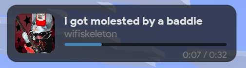
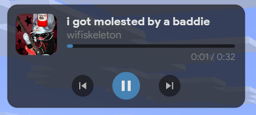
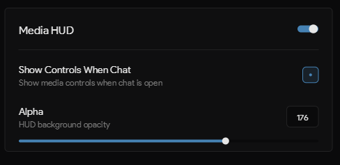

<h1 align="center">
  TrashAddons
</h1>

A Cobalt addon with one feature only for now.

## How to install
1. If you don't have Cobalt, download it from [Cobalt Releases](https://github.com/CobaltScripts/Cobalt/releases) and put it in your `.minecraft/mods/` folder
2. Download the latest TrashAddons `.jar` from [Releases](https://github.com/trashofmyteeth/trashaddons/releases)
3. Put it into `.minecraft/config/cobalt/addons/`

## Features
- **Media HUD**: now playing overlay with album art, title, artist, and progress bar
- Playback controls (play/pause, skip, previous)

  
<strong>Normal</strong>

  
  
<strong>Expanded (chat open)</strong>

  
  
<strong>Settings</strong>

  

**Supports Windows and Linux.**

**⚠️ Does not support macOS yet.** might be added later.

maybe more features later idk
